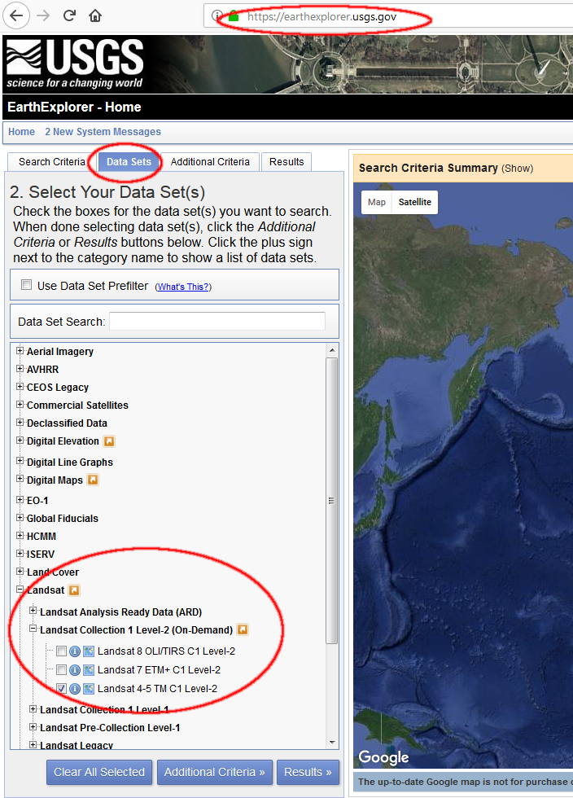
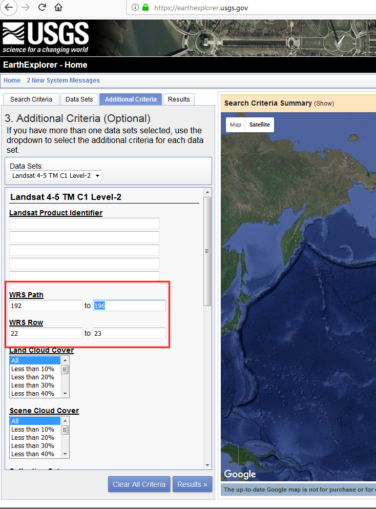
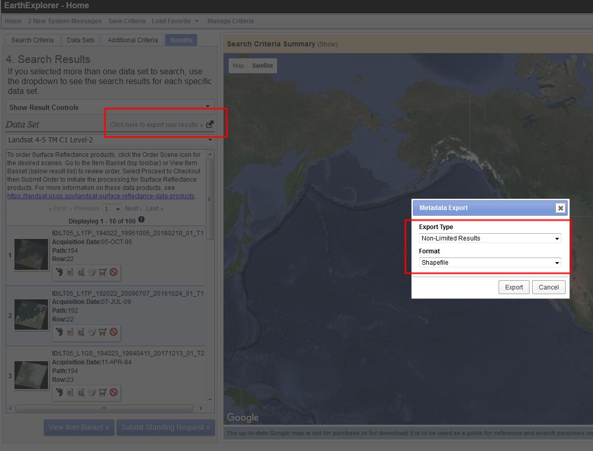
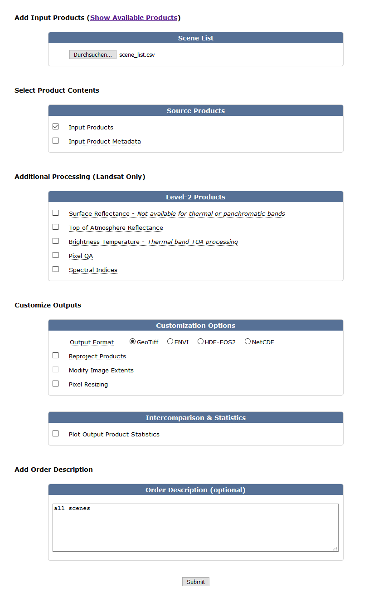

# Selecting Landsat images

Unfortunately, the NASA Landsat images need to be selected via an online mask on USGS's [webpage](https://earthexplorer.usgs.gov/). My approach was to extract the identifier of the images that I want to download and then feed them into the USGS website. This way a bulk download is possible. The necessary file to identify the images can be downloaded from [USGS](https://landsat.usgs.gov/pathrow-shapefiles).  
  
I only care about pictures taken between June and August by Landsat 5 which operated between 1985 and 2011. The reason is that the sizes of the images are large, including scences from the whole year means that the reflected colors change and thus, more images are necessary to train the algorithm. Additionally, clouds block the view and I assume that there are less clouds in the summer than in the winter, which increases the number of useable scenes.  
  
## Locating the scenes
First, I identify the `PATH` and the `ROW` which are necessery to identify the scenes.  

```{r extractlandsat,fig.cap="MV with scenes.",cache=TRUE}

wrs2<-readOGR("data/spatial/wrs2/wrs2_descending.shp",
              verbose=FALSE)

pol_extent2 <- as(pol_extent,"Spatial") %>% 
  SpatialPolygonsDataFrame(data=data.frame(x=1))

mv_wrs2 <- wrs2[which(!is.na(over(wrs2,pol_extent2,returnList =FALSE))),] 

mv_wrs2 %>% 
  st_as_sf() %>% 
  ggplot() +
  geom_sf(data=mv) +
  geom_sf(fill=NA) 

```

With the `PATH` and `ROW` numbers (Table \@ref(tab:kab1)), I turned to the eartexplorer website to search for the images. Instead of downloading the images, which are around 2 GB each, I extracted the meta file (Figure \@ref(fig:earthex1), \@ref(fig:earthex2), and \@ref(fig:earthex3)).


```{r kab1,echo=TRUE,cache=TRUE}
scenes <- wrs2@data[which(!is.na(over(wrs2,pol_extent2,returnList =FALSE))),c("PATH","ROW")]

data.frame(PATH = c(min(scenes$PATH),max(scenes$PATH)),
           ROW = c(min(scenes$ROW),max(scenes$ROW)),row.names = c("Min","Max")) %>% 
  kable(cap="PATH and ROW to retrieve scene list from Earthexplorer.")
```


```{r earthex1,echo=FALSE,fig.align="center",fig.cap="Screenshot of selecting Landsat 4-5 from Earthexplorer.",cache=TRUE}

```

```{r earthex2,echo=FALSE,fig.align="center",fig.cap="Screenshot of selecting Landsat 4-5 from Earthexplorer.",cache=TRUE}

```

```{r earthex3,echo=FALSE,fig.align="center",fig.cap="Screenshot of selecting Landsat 4-5 from Earthexplorer.",cache=TRUE}

```

## Reducing the scenes

The metadata can be read it and analyzed on its own. First, I only select images from Landsat 5 between June and August. I then calculate the lowest cloud coverage for each scene in each year. Third, I calculate the overal maximum of the lowest yearly coverages and the mean cloud coverare for each scene (Table \@ref(tab:images)). It turns out that scene `194@22` and `194@23` have the most favorable numbers and cover most of the territory of MV (Figure \@ref(fig:selectedscenes))

```{r images,cache=TRUE}

images_df <- read.csv("data/rectangular/scene_list/LSR_LANDSAT_TM_C1_279839.csv") %>% 
  mutate(month = strsplit(Acquisition.Date,"/") %>% 
           lapply(`[[`,2) %>% 
           unlist() %>% 
           as.numeric(),
         year = strsplit(Acquisition.Date,"/") %>% 
           lapply(`[[`,1) %>% 
           unlist() %>% 
           as.numeric(),
         satelitte = strsplit(Landsat.Product.Identifier,"_") %>% 
           lapply(`[[`,1) %>% 
           unlist(),
         PATHROW = strsplit(Landsat.Product.Identifier,"_") %>% 
           lapply(`[[`,3) %>% 
           unlist()) %>% 
  mutate(PATH = substr(PATHROW,1,3) %>%
           as.numeric(),
         ROW = substr(PATHROW,4,6) %>%
           as.numeric()) %>%
  filter(month > 6 & month < 9) %>% 
  filter(satelitte == "LT05")

exp <- images_df %>% 
  expand(year,PATH,ROW)

exp$minimum_cloud_cover <- apply(exp,1,function(x) {
  f1 <- images_df %>% 
    filter(year == x[1]&
             PATH == x[2]&
             ROW == x[3]) 
  if (nrow(f1) == 0) return(NA)
  f1  %$% 
    Land.Cloud.Cover %>% 
    min
})


exp %>% 
         mutate(PATHROW=paste0(PATH,"@",ROW)) %>% 
  group_by(PATHROW) %>% 
  summarise(`Maximum of yearly minimum cloud cover`=max(minimum_cloud_cover,na.rm=TRUE),
            `Mean Cloud Cover`=round(mean(minimum_cloud_cover,na.rm=TRUE),2)) %>% 
  kable(caption = "Maximum and mean cloud cover for different scenes.")


  


```

```{r selectedscenes,fig.align="center",fig.cap="Scenes 194@22 and 194@23."}
ggplot() +
  geom_sf(data = mv) +
  geom_sf(data = mv_wrs2 %>% 
            st_as_sf() %>% 
            mutate(PATHROW=paste0(PATH,"@",ROW)) %>% 
            filter(PATHROW %in% c("194@22","194@23")),fill=NA)

```

```{r cloudthreshold}
cloudthreshold <- 50

number_of_scenes <- images_df %>% 
  mutate(PATHROW=paste0(PATH,"@",ROW)) %>%
  filter(PATHROW %in% c("194@22","194@23")&Land.Cloud.Cover<cloudthreshold&grepl("_T1",Landsat.Product.Identifier)) %>% 
  nrow

```

I further reduce the number of scenes to only account for images with a cover less than 50\%. A total of `r number_of_scenes` are still being considered. Figure \@ref(fig:scenesperyear) shows the distribution of cloud covers for both scenes from 1984 to 2011.

```{r scenesperyear,fig.align="center",fig.cap="Scenes"}
images_df %>% 
  mutate(PATHROW=paste0(PATH,"@",ROW)) %>%
  filter(PATHROW %in% c("194@22","194@23")&Land.Cloud.Cover<cloudthreshold&grepl("_T1",Landsat.Product.Identifier)) %>%
  ggplot() +
  geom_point(aes(x=year,y=Land.Cloud.Cover,group=PATHROW,color=PATHROW)) +
  ylab("Area covered by clouds") +
  xlab("Year") +
  scale_color_discrete(name="Scenes")
```

## Bulk download scenes

```{r makescenelist}
images_df %>% 
  mutate(PATHROW=paste0(PATH,"@",ROW)) %>%
  filter(PATHROW %in% c("194@22","194@23")&Land.Cloud.Cover<cloudthreshold&grepl("_T1",Landsat.Product.Identifier)) %>% 
  dplyr::select(Landsat.Product.Identifier) %>% 
  fwrite("scene_list.csv",col.names = FALSE)

```

The list needs to be uploaded on [Earthexplorer](http://earthexplorer.usgs.gov/filelist). 

```{r bulkdownload,fig.cap="Screenshot of [Earthexplorer](http://earthexplorer.usgs.gov/filelist) mask.",echo=FALSE,cache=TRUE}

```


Once the scenes are ready, I copied the source code of the website and extracted the urls to the files since they are not directly password protected. Then I downloaded them and untarred them.

```{r downloadanduntar,eval=FALSE}
website <- readLines("data/landsatwebsite/website",warn=FALSE)
urls <- website[grep("Download</a>",website)] %>% 
  strsplit(">") %>% 
  lapply(`[[`,1) %>% 
  unlist() %>% 
  gsub("<a href=\"","",.) %>% 
  gsub("\"","",.) %>% 
  gsub(" ","",.)

save_files <- urls %>% 
  strsplit("/") %>% 
  lapply(`[[`,6) %>% 
  unlist()

sapply(1:length(urls),function(x) {
  download.file(url = urls[x],
                destfile = paste0("E:/landsatscene/",save_files[x]))
})


tar_files <- list.files("E:/landsatscene/",full.names = TRUE)


sapply(tar_files,function(x) {
  if (file.exists(x %>% 
      gsub(".tar.gz","",.))) return()
  untar(x,exdir = x %>% 
        gsub(".tar.gz","",.))
  })
```

